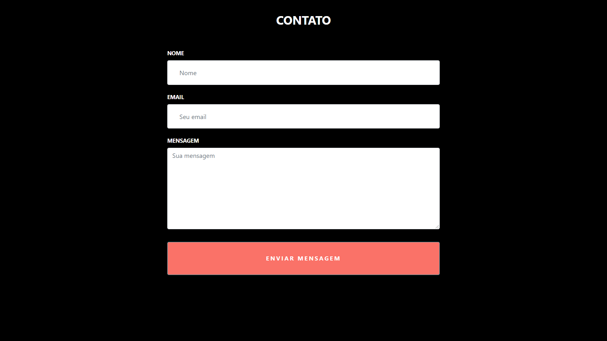

# Enviar email com React JS

### Muito simples, para desenvolvedores front-end que não tem tempo para criar o back-end
### Só seguir o passo a passo, de configuração de id, e pronto, só colocar no seu site!

